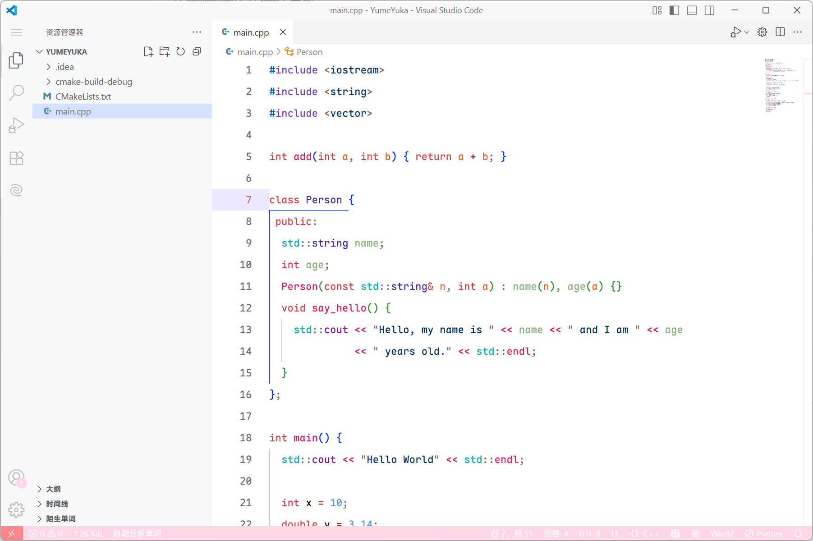

# YumeLight-vscode-theme

> 一个 VS Code 主题   


## 特性

*   白色和粉色的配色方案。
*   为多种语言提供语法高亮。

## 安装

1.  在 VS Code 的扩展商店中搜索 `YumeLight` 并安装。
2.  在 **文件 > 首选项 > 主题 > 颜色主题** 中选择 `Yume Light`。

## 开发

在本地开发时，需要合并 token 文件：

```sh
node themes/merge-theme.js
```

## 许可证
```
YumeYuka Starry Oath

版权所有 (c) 2025 YumeYuka

特此授予任何人自由复制、分发、修改、合并、销售、出版、再授权或以其他方式使用本作品的权限，但须满足以下条件：

1. 所有副本或本作品的重要部分必须包含"YumeYuka"作为原始作者的姓名。
2. 使用本作品的所有风险和责任由使用者自行承担。

作者YumeYuka将本作品"按原样"提供，不提供任何明示或暗示的担保，包括但不限于适销性、特定用途的适用性及不侵权的担保。本作品可能运行，也可能完全失效，不存在中间状态。

            条款和条件

0. 作者对因使用本作品而产生的任何索赔、损害或问题不承担任何责任，无论是在合同、侵权或其他情况下。

星空之下，自由归于你
```